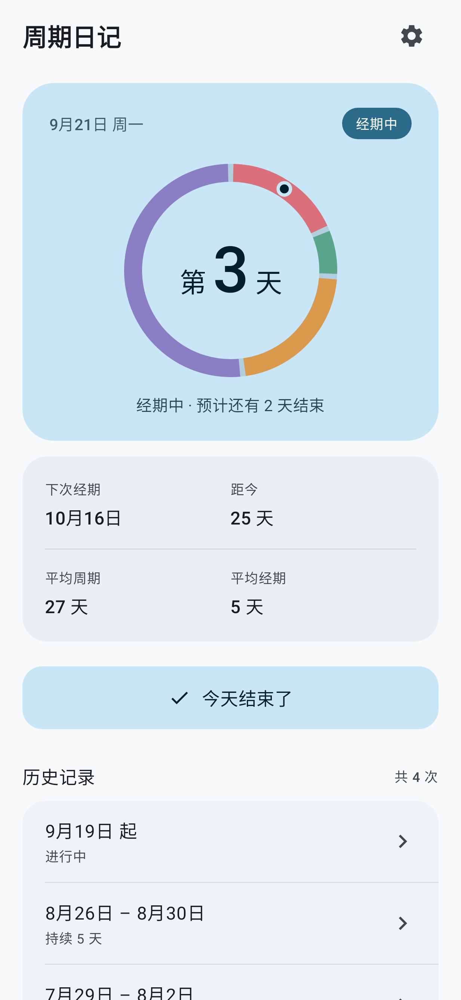
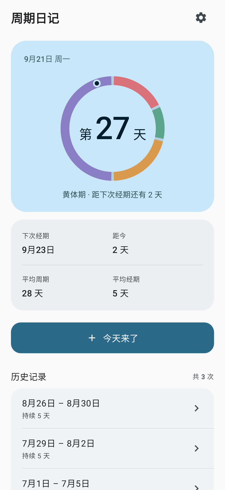
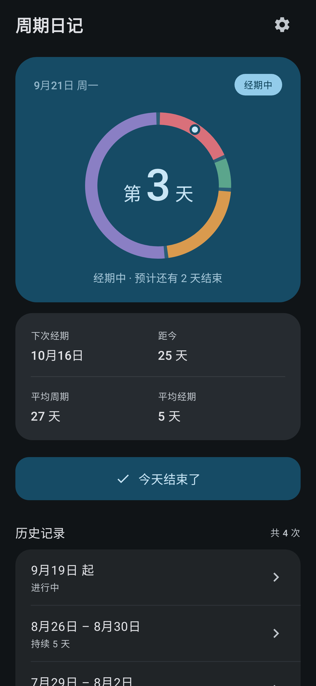
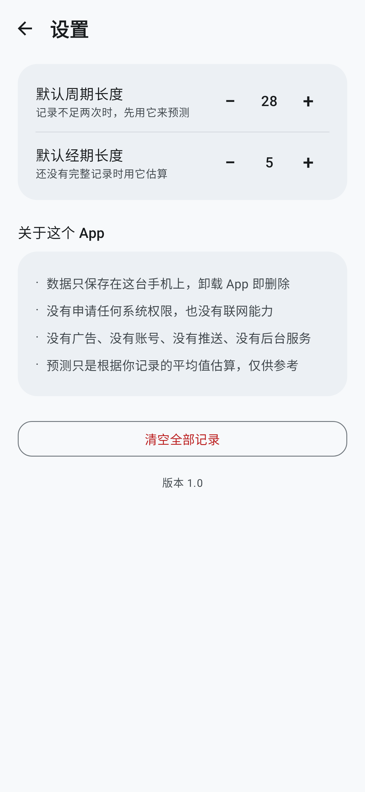

# 周期日记

一个只给一个人用的经期记录 App。干净、无广告、无账号、无联网、无通知、无后台服务。

主页只有一屏：一眼看到今天是周期第几天、处在哪个阶段、下次经期什么时候、一个按钮记录开始或结束。

<p align="center">
  
  
  
  
</p>

## 功能

就这些，没有别的：

| 功能 | 说明 |
|---|---|
| 记录经期开始 | 主页唯一的按钮，点一下记下今天 |
| 记录经期结束 | 同一个按钮，有未结束的记录时会变成「今天结束了」 |
| 预测下次经期 | 取最近 6 次相邻开始日期间隔的平均值 |
| 当前周期第几天 | 环形周期图中心的大字，从最近一次经期第一天算起 |
| 生理周期阶段 | 环形图按 经期 / 卵泡期 / 排卵期 / 黄体期 分段着色，环上一个小圆点标记今天，环下写明当前阶段 |
| 改 / 删记录 | 点历史里任意一条，可改开始结束日期或删除 |

刻意不做：通知提醒、账号、同步、导出、症状 / 心情 / 体温记录、日历、统计图表、广告、埋点。

## 数据与隐私

全部数据存在 App 私有目录下的一个 JSON 文件里：`filesDir/cycle-diary.json`。

- 其他 App 读不到，卸载 App 即删除
- 清单里设了 `allowBackup="false"` + 数据迁移排除规则，云备份也拿不走
- 写入时先写临时文件再改名，避免中途被杀进程写出半截文件
- 不申请任何系统权限，没有联网能力

打包后的清单里会出现一条 `com.cyclediary.app.DYNAMIC_RECEIVER_NOT_EXPORTED_PERMISSION`，
那是 AndroidX 自动注入的、App 定义给自己的签名级权限，不出现在系统权限页面，也不授予任何访问能力。

## 预测与阶段规则

写在 `domain/CycleMath.kt`，规则很简单，也刻意保守：

- 平均周期 = 最近 6 次「相邻开始日期」间隔的平均值
- 间隔小于 15 天或大于 60 天的直接丢掉，避免一次误触把预测带偏
- 记录不足两次时用设置里的默认值，界面上会明确写出「目前是默认值估算」
- 下次经期 = 最近一次开始日期 + 平均周期
- 超过预测日还没记录时显示「已经过了 N 天」，不伪造一个新日期
- 平均经期长度只统计已结束的记录

生理阶段按通用公式估算，不做个性化校准：

- 排卵日 = 下次经期开始日前 14 天
- 排卵期（易孕窗口）= 排卵日前 5 天到排卵日当天，共 6 天
- 黄体期 = 排卵日次日到下次经期前一天；推迟的日子里黄体期就当被拉长了
- 卵泡期 = 经期结束后到易孕窗口开始前
- 周期太短、阶段互相挤压时，排卵日至少排在经期结束之后，保证四段不重叠

规则有测试兜着，见 `app/src/test/.../domain/PredictionTest.kt` 和 `StageTest.kt`。

## 技术栈

Kotlin + Jetpack Compose + Material 3，单模块原生 Android。

- `minSdk 26`（Android 8.0 及以上）、`targetSdk 35`
- AGP 8.7.3 / Kotlin 2.0.21 / Compose BOM 2024.10.01
- 没有用 Room、Hilt、Navigation——对一个一屏 App 来说它们只增加出错面

配色刻意锁死，没有开启 Material You 跟随壁纸取色，避免变成粉色系。

## 构建

需要 JDK 17 或 21，以及 Android SDK（`platforms;android-35`、`build-tools;35.0.0`）。

```powershell
# Windows：脚本会自动找 JDK 和 Android SDK
.\build.ps1              # 出正式版 APK
.\build.ps1 test         # 跑测试 + 重新生成界面截图
.\build.ps1 install      # USB 连上手机后直接安装
```

```bash
# 其他平台直接用 Gradle Wrapper
./gradlew assembleRelease
./gradlew testDebugUnitTest
```

产物：`app/build/outputs/apk/release/app-release.apk`

如果脚本找不到 SDK，在项目根目录建一个 `local.properties`：

```properties
sdk.dir=/path/to/Android/Sdk
```

## 签名

发新版本必须用同一个密钥，否则手机会拒绝覆盖安装、只能先卸载。

仓库里**不含**密钥，它和密码都在 `.gitignore` 里：

```
keystore/cyclediary.jks     ← 密钥本体
keystore.properties         ← 密码
```

第一次构建前需要自己生成一个：

```bash
keytool -genkeypair -v -keystore keystore/cyclediary.jks \
  -alias cyclediary -keyalg RSA -keysize 2048 -validity 10950
```

然后照 `keystore.properties` 的格式填好路径、密码和别名。

## 界面怎么看（不需要模拟器）

界面渲染结果可以用测试导成 PNG：

```powershell
.\build.ps1 screenshots
```

走 Robolectric 原生图形模式在 JVM 上真实光栅化，产物在 `app/build/screenshots/`。
目前覆盖经期中 / 周期中 / 空状态 / 深色模式 / 设置页五种情况。

## 目录

```
app/src/main/java/com/cyclediary/app/
├── MainActivity.kt            入口
├── data/
│   ├── Model.kt               数据结构 + 数据清洗
│   └── CycleStore.kt          JSON 读写
├── domain/
│   └── CycleMath.kt           预测与阶段估算（唯一"算"东西的地方）
└── ui/
    ├── CycleDiaryApp.kt       根组合，回前台时校准"今天"
    ├── HomeScreen.kt          主页
    ├── HomeViewModel.kt       状态与增删改
    ├── EditRecordDialog.kt    改日期 / 删除
    ├── SettingsScreen.kt      设置
    ├── DateFormats.kt         日期格式
    └── theme/                 配色与字体
```
